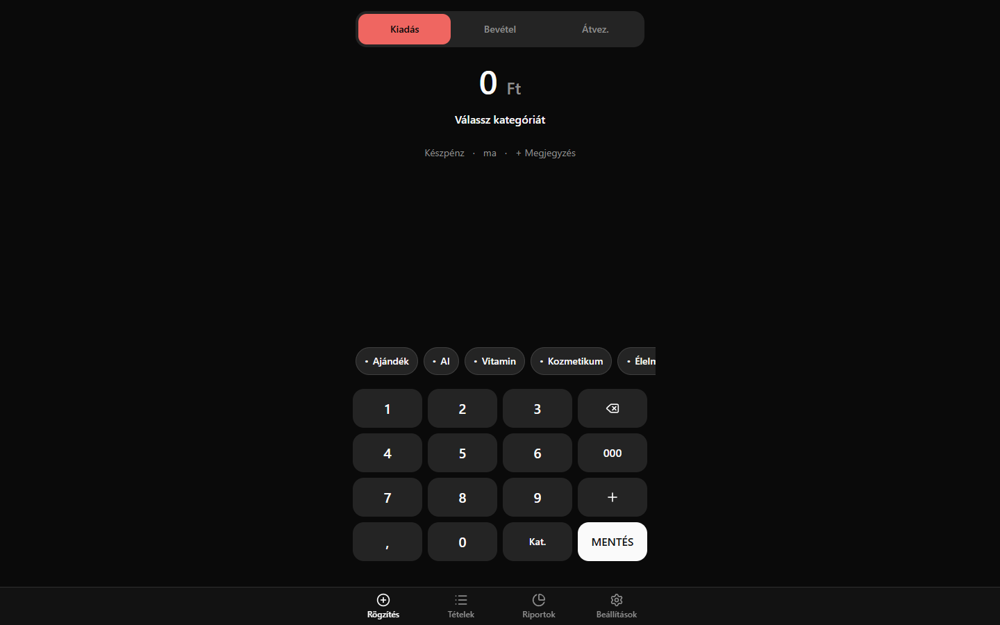
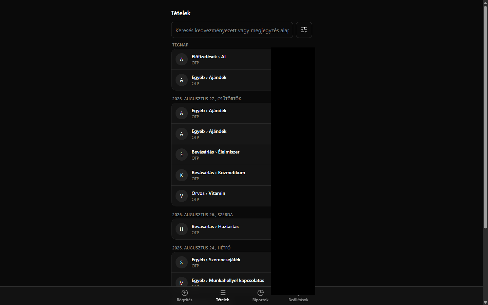
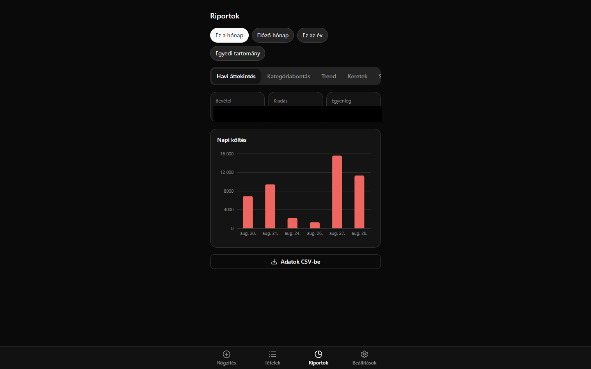
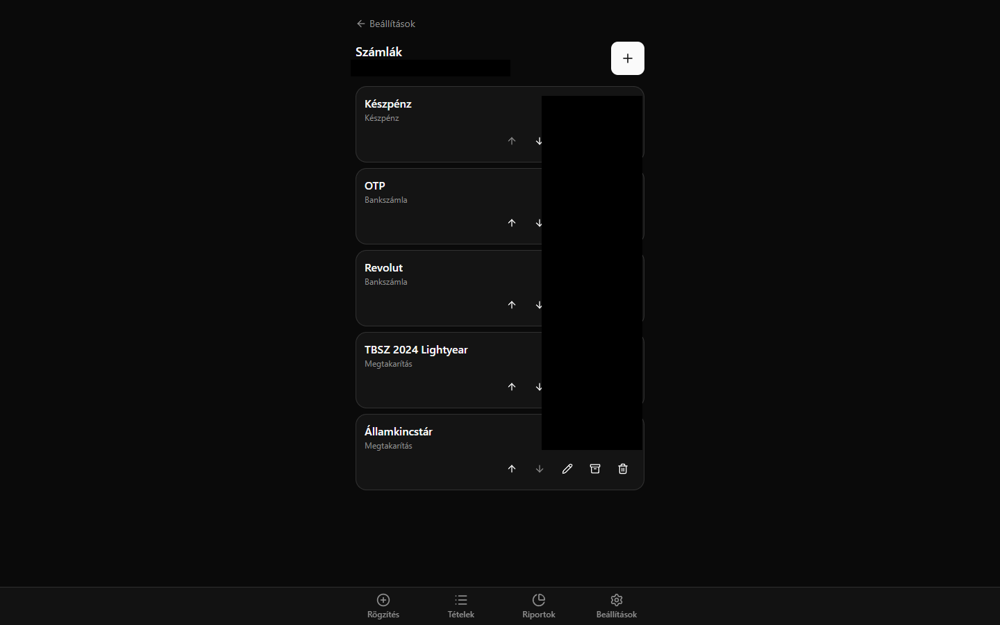
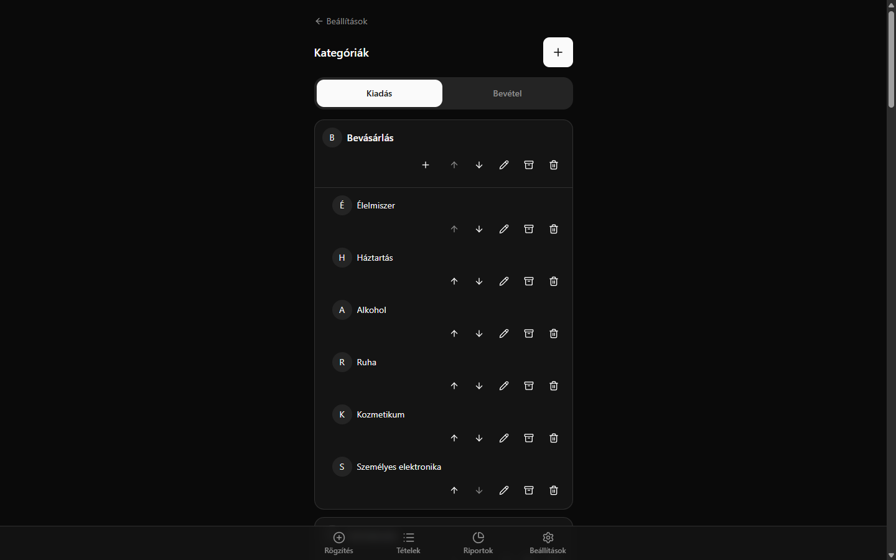
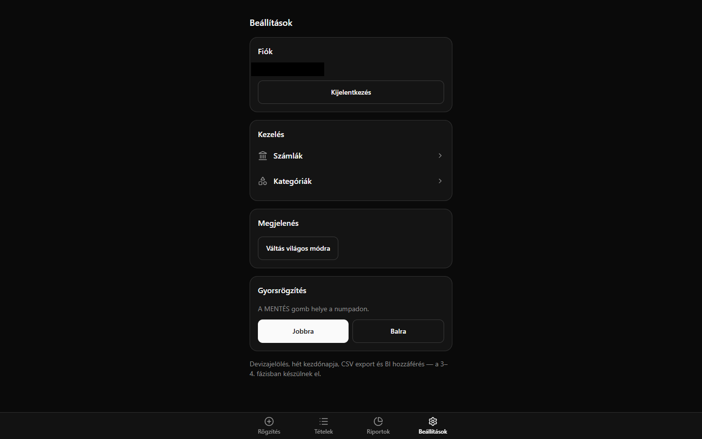

# Költségkövető

Egyfelhasználós, személyes költségkövető PWA. Gyors, numpad-alapú
tranzakció-rögzítés, számla- és kategóriakezelés, riportok — mobilra
optimalizálva, telefonra telepíthető alkalmazásként is.

Részletes termékspecifikáció: [koltsegkoveto-specifikacio.md](./koltsegkoveto-specifikacio.md).

## Képernyők

| Gyorsrögzítés | Tranzakciók | Riportok |
|---|---|---|
|  |  |  |

| Számlák | Kategóriák | Beállítások |
|---|---|---|
|  |  |  |

## Technológia

React 19 + TypeScript + Vite · Tailwind CSS v4 · shadcn/ui · React Router
· Supabase (Postgres + Auth, Row Level Security) · TanStack Query ·
react-hook-form + zod · date-fns · vite-plugin-pwa.

## Helyi fejlesztés

```bash
npm install
cp .env.example .env   # töltsd ki a Supabase URL-t és anon kulcsot (lásd lent)
npm run dev
```

Az app a `http://localhost:5173` címen fut.

```bash
npm run build      # production build (tsc -b && vite build)
npm run preview    # a build kipróbálása lokálisan
npm run lint        # oxlint
```

## Környezeti változók

A `.env` fájl (soha ne kerüljön verziókezelésbe — a `.gitignore` már kizárja):

```
VITE_SUPABASE_URL=https://xxxxxxxxxxxx.supabase.co
VITE_SUPABASE_ANON_KEY=eyJ...
```

Csak az **anon** (public) kulcs kerülhet ide. A `service_role` kulcs sosem
kerülhet a frontendbe vagy verziókezelésbe — az adatbiztonságot a Postgres
Row Level Security (RLS) szabályok adják, `user_id = auth.uid()` alapon.
Mindkét érték a Supabase projekt **Settings → API** oldalán található.

## Supabase projekt felállítása

1. Hozz létre egy új Supabase projektet a [supabase.com](https://supabase.com)
   konzolon.
2. Futtasd le a migrációkat a `supabase/migrations` mappából:
   ```bash
   npx supabase login
   npx supabase link --project-ref <a-projekted-ref-je>
   npx supabase db push
   ```
   (vagy kézzel, az SQL Editorban, a fájlokat név szerinti sorrendben.)
3. **Tiltsd le a publikus regisztrációt** — Authentication → Providers →
   Email → kapcsold ki az "Allow new users to sign up" opciót. Ez egy
   egyfelhasználós app, a regisztrációs felület szándékosan nem létezik.
4. **Hozd létre az egyetlen felhasználót kézzel** — Authentication → Users
   → "Add user", pipáld be az "Auto Confirm User" opciót. Egy adatbázis-
   trigger automatikusan létrehozza a magyar alapkategória-készletet.
5. Másold ki a projekt URL-t és anon kulcsot (Settings → API) a `.env`
   fájlba, majd jelentkezz be a `/login` oldalon.

## Deploy

A build statikus kimenet (`dist/`), ezért bármelyik statikus hosting
megfelel (Vercel, Cloudflare Pages, stb.), build parancs `npm run build`,
kimeneti mappa `dist`. A környezeti változókat a hosting felületén kell
beállítani, ugyanazokkal az értékekkel, mint a lokális `.env`-ben.
