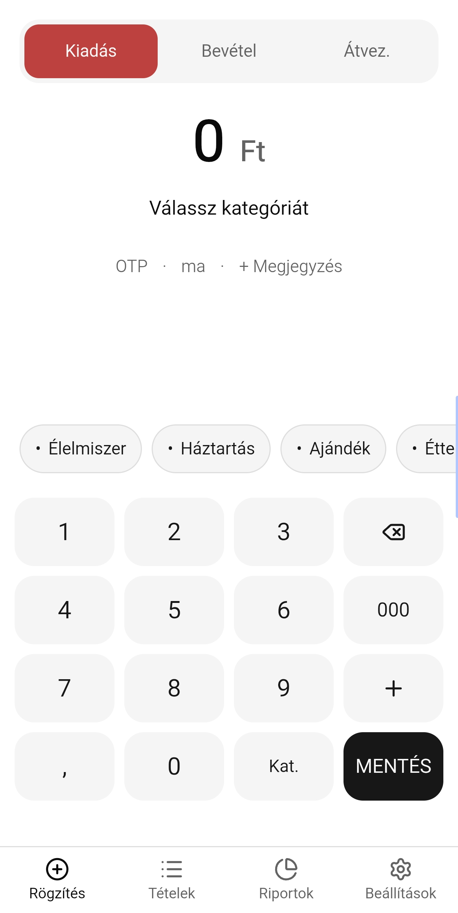
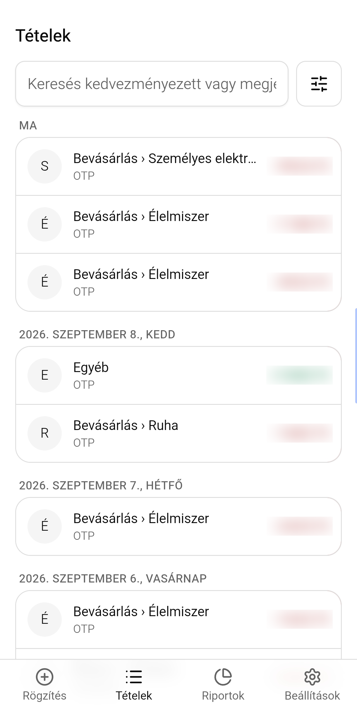
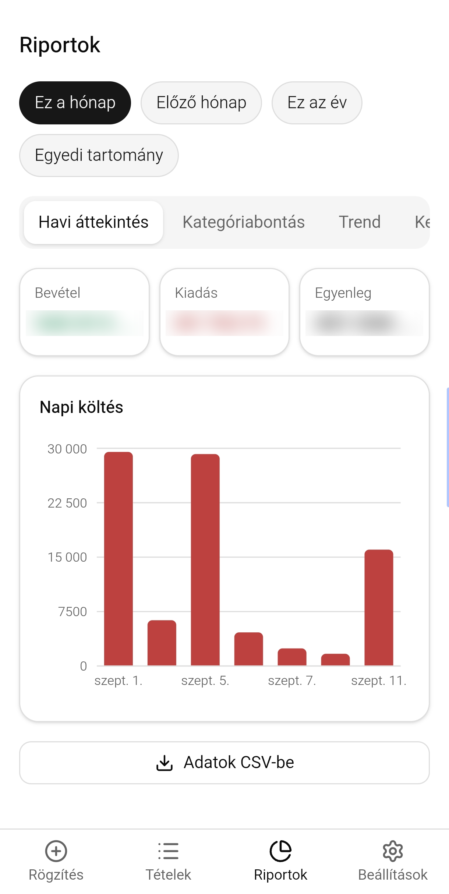
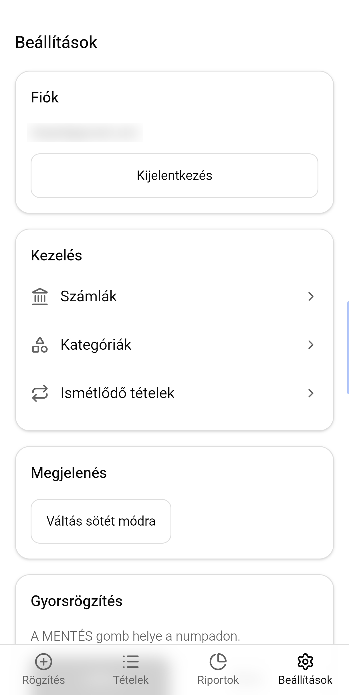
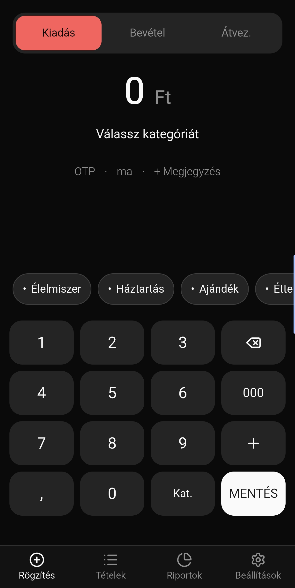
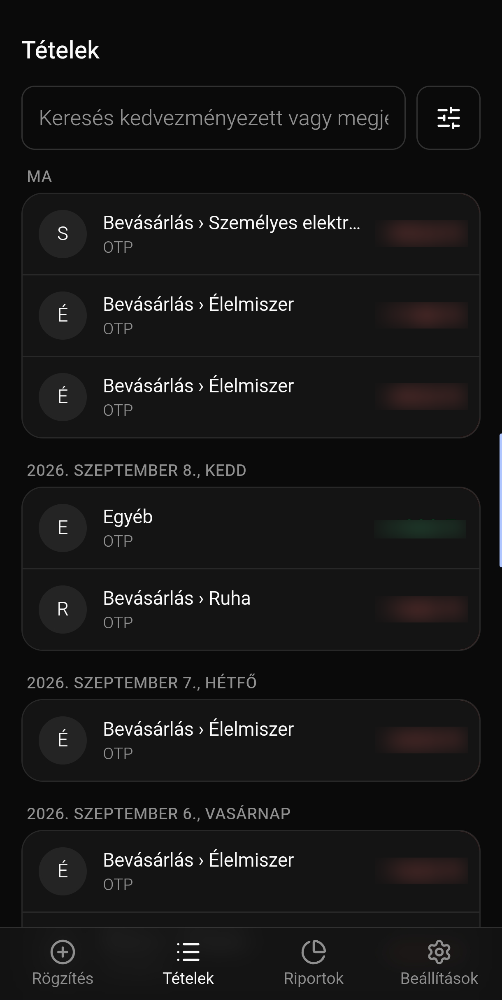
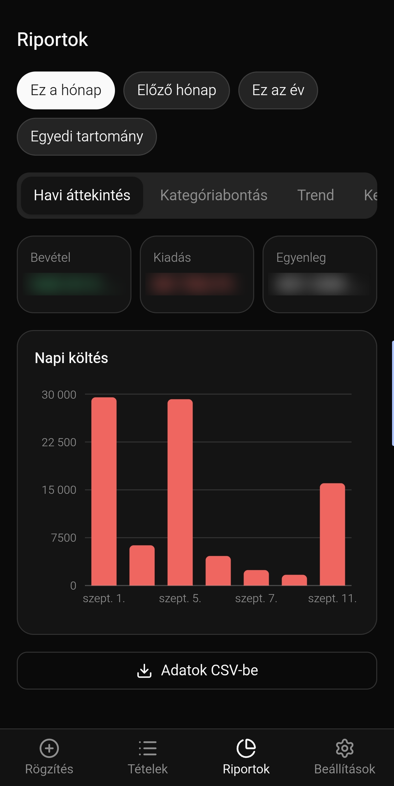
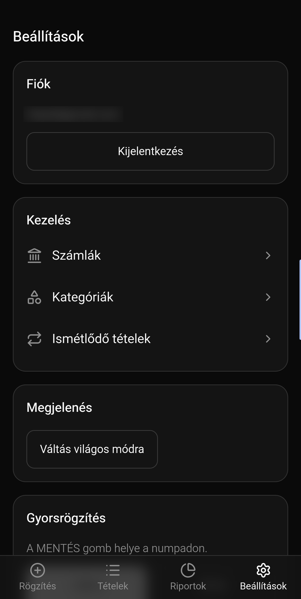

# Budget Tracker

A single-user, personal budget tracking PWA. Fast, numpad-based
transaction entry, account and category management, reports — optimized
for mobile, installable on your phone as an app.

Detailed product specification (in Hungarian): [koltsegkoveto-specifikacio.md](./koltsegkoveto-specifikacio.md).

## Screens

| Quick Entry | Transactions | Reports | Settings |
|:---:|:---:|:---:|:---:|
|  |  |  |  |
|  |  |  |  |

## Tech Stack

React 19 + TypeScript + Vite · Tailwind CSS v4 · shadcn/ui · React Router
· Supabase (Postgres + Auth, Row Level Security) · TanStack Query ·
react-hook-form + zod · date-fns · vite-plugin-pwa.
